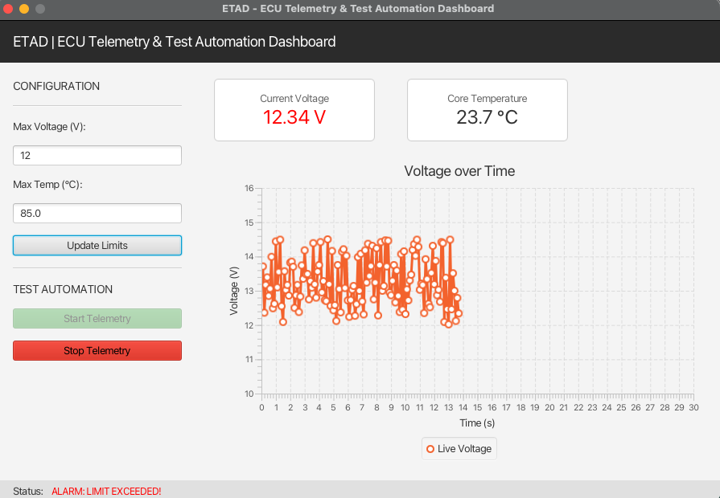
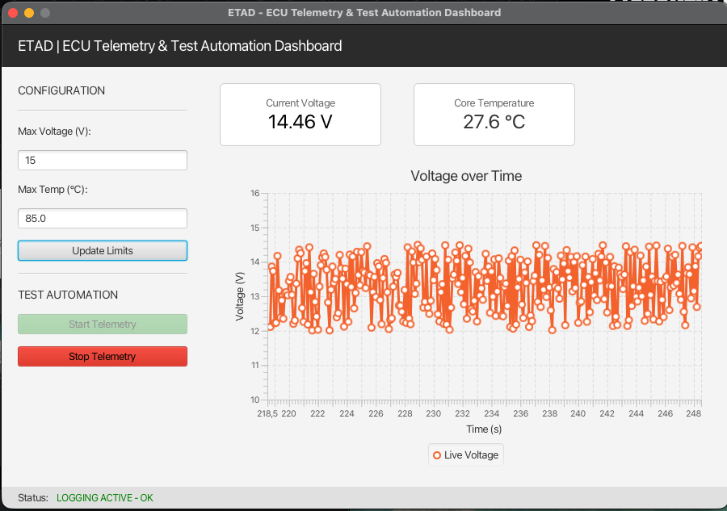
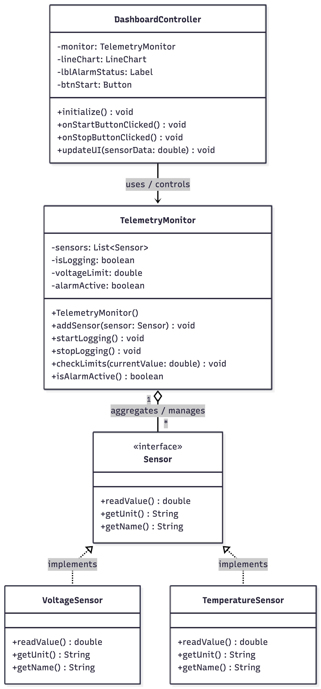

# 🏎️ ETAD: ECU Telemetry & Test Automation Dashboard


**Eine Desktop-Applikation zur simulierten Telemetrie-Erfassung, Echtzeit-Visualisierung und automatisierten Grenzwertprüfung von elektronischen Steuergeräten (ECU).** Entworfen und entwickelt von Oliver Mandic.

---

## 📌 Projektübersicht
Dieses Projekt wurde entwickelt, um branchenübliche Software-Engineering-Praktiken im Kontext von **Hardware-in-the-Loop (HIL) Tests** und der Telemetrie in der Automobil- und Luftfahrtindustrie zu demonstrieren.

Es simuliert die Verbindung zu einer ECU, ruft Echtzeitdaten (Hauptbatteriespannung & Kerntemperatur) ab, visualisiert die Telemetrie über ein Live-JavaFX-Dashboard und überwacht das System kontinuierlich auf konfigurierbare Sicherheitsgrenzwerte (z. B. Überhitzung/Thermal Throttling und Überspannung).

### 📸 Screenshots




---

## ⚙️ Hauptfunktionen

* **Echtzeit-Telemetrie-Visualisierung:** Ein sich live aktualisierendes Liniendiagramm (`LineChart`) und digitale Anzeigen für Sensordaten.
* **Dynamische Grenzwertüberwachung:** Benutzer können maximale Spannungs- und Temperaturgrenzwerte im laufenden Betrieb konfigurieren.
* **Automatisches Alarmsystem:** Die Logik des `TelemetryMonitor` löst sofort visuelle Warnungen aus, wenn sichere Betriebsgrenzen überschritten werden, und simuliert so ECU-Notzustände.
* **Polymorphe Sensorsimulation:** Dummy-Sensoren erzeugen realistische Daten mit Random-Walk-Algorithmen und Rauschsimulation.

---

## 🛠️ Tech-Stack & Architektur

Dieses Projekt hält sich streng an die Prinzipien der **objektorientierten Programmierung (OOP)** und das **Model-View-Controller (MVC)** Entwurfsmuster, um Skalierbarkeit, Testbarkeit und sauberen Code zu gewährleisten.

* **Sprache:** Java 17
* **Build-System:** Maven
* **GUI-Framework:** JavaFX (FXML & Scene Builder)
* **Unit-Testing:** JUnit 5 (Jupiter)
* **Mocking-Framework:** Mockito

### Architekturdiagramm (UML)


* **Model (`Sensor` Interface):** Definiert den Vertrag (Contract) für die simulierten Hardwarekomponenten (`VoltageSensor`, `TemperatureSensor`).
* **Controller (`TelemetryMonitor`):** Die isolierte Geschäftslogik, die für die Datenauswertung und Grenzwertprüfung zuständig ist.
* **View (`DashboardController`):** Das JavaFX-Frontend, vollständig entkoppelt von der Validierungslogik.

---

## 🧪 Testautomatisierung

Eine Kernanforderung für sicherheitskritische Systeme sind strenge Tests. Die Geschäftslogik (`TelemetryMonitor`) ist vollständig durch automatisierte Unit-Tests mit **JUnit 5** abgedeckt.

Um Randfälle zu simulieren, ohne sich auf zufällige Sensordaten verlassen zu müssen, wird **Mockito** verwendet. Damit werden "gemockte" (gefälschte) Sensoren injiziert, die absichtlich Überspannungs- oder Überhitzungsszenarien auslösen und die korrekte Reaktion des Alarmsystems validieren.


```bash
# Ausführen der automatisierten Test-Suite
mvn test
```
